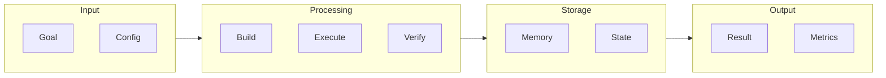
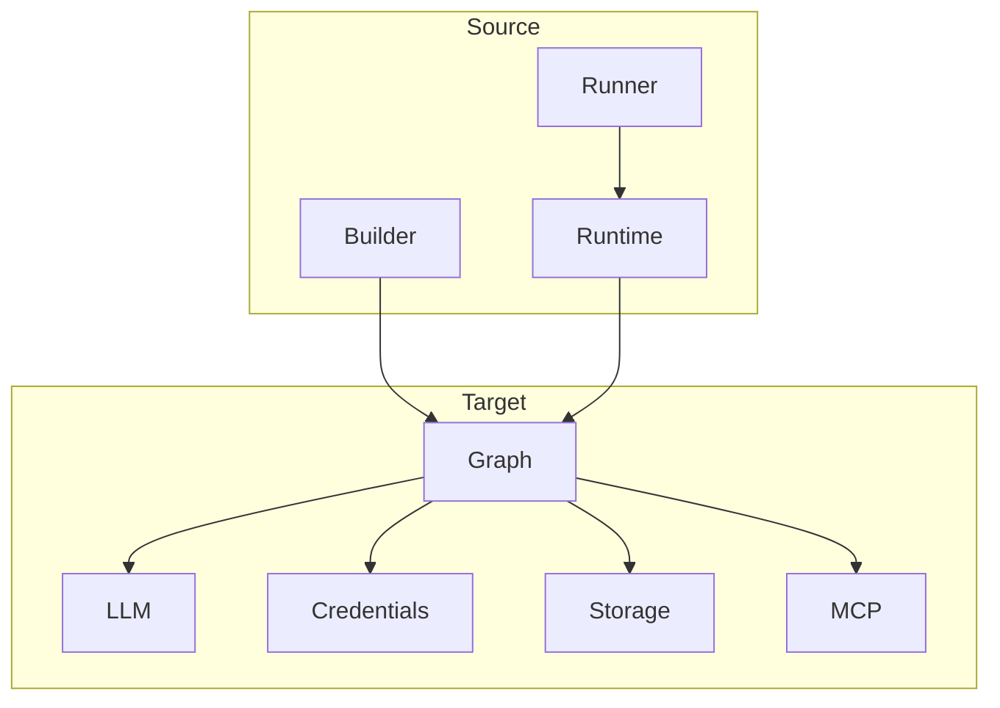
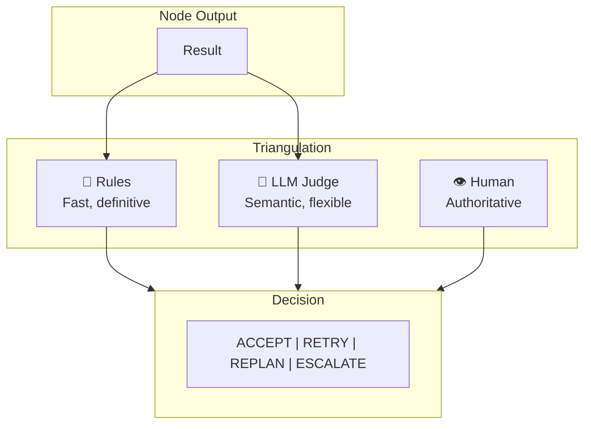

# Hive Agent Framework - Architecture Documentation

## Overview

Hive is a production-ready AI agent framework for building **goal-driven, self-improving agents** without hardcoding workflows. The framework uses a node-based architecture with triangulated verification for reliability.

## Architecture Diagram

```mermaid
flowchart TB
    subgraph User["User Layer"]
        Goal["🎯 Natural Language Goal"]
        HITL["👤 Human-in-the-Loop"]
    end

    subgraph Builder["Builder Layer"]
        Plan["📋 Plan Generator"]
        Builder["🔨 Agent Builder"]
        Query["🔍 Query Builder"]
    end

    subgraph Core["Core Framework"]
        subgraph Runtime["Runtime Layer"]
            AgentRuntime["⚡ Agent Runtime"]
            ExecutionStream["📡 Execution Stream"]
            EventBus["🚌 Event Bus"]
            OutcomeAgg["📊 Outcome Aggregator"]
        end

        subgraph Graph["Graph Execution Layer"]
            GraphExec["🔄 Graph Executor"]
            Node["📦 Node Base Class"]
            WorkerNode["👷 Worker Node"]
            FlexExec["🔀 Flexible Executor"]
        end

        subgraph LLM["LLM Integration Layer"]
            Anthropic["🦊 Anthropic Provider"]
            LiteLLM["💡 LiteLLM Provider"]
            Mock["🎭 Mock Provider"]
        end

        subgraph Credentials["Credentials Layer"]
            Store["🔐 Credential Store"]
            Vault["🏦 Vault Integration"]
            OAuth2["🔑 OAuth2 Provider"]
            ADen["🔄 ADen Sync"]
        end

        subgraph MCP["MCP Layer"]
            AgentBuilderServer["🛠️ Agent Builder MCP Server"]
        end

        subgraph Storage["Storage Layer"]
            Backend["💾 Storage Backend"]
            Conversation["💬 Conversation Store"]
            Concurrent["⚡ Concurrent Storage"]
        end

        subgraph Runner["Runner Layer"]
            Orchestrator["🎼 Orchestrator"]
            MCPRunner["🔧 MCP Runner"]
            CLI["⌨️ CLI Runner"]
        end
    end

    subgraph Verification["Triangulated Verification"]
        Rules["📏 Deterministic Rules"]
        LLMJudge["🧠 LLM Judge"]
        Human["👁️ Human Judgment"]
    end

    subgraph Testing["Testing Framework"]
        TestCase["✅ Test Cases"]
        LLMJudgeTest["🎯 LLM Judge Testing"]
        Debug["🔎 Debug Tools"]
    end

    %% Connections
    Goal --> Builder
    Builder --> Core
    Core --> Verification
    Verification -->|Low Confidence| HITL
    Core --> Testing

    Builder --> Plan
    Builder --> Query

    Runtime --> Graph
    Graph --> LLM
    Graph --> Credentials
    Graph --> MCP
    Graph --> Storage

    Runner --> Runtime

    style User fill:#e3f2fd,stroke:#1976d2
    style Builder fill:#fff3e0,stroke:#f57c00
    style Core fill:#e8f5e9,stroke:#388e3c
    style Verification fill:#fce4ec,stroke:#c2185b
    style Testing fill:#f3e5f5,stroke:#7b1fa2
```

## Component Details

### 1. User Layer
- **Natural Language Goal**: Users define goals in plain English
- **Human-in-the-Loop**: Intervention points for human oversight

### 2. Builder Layer
- **Plan Generator**: Creates execution plans from goals
- **Agent Builder**: Builds agent graphs dynamically
- **Query Builder**: Constructs queries for data retrieval

### 3. Core Framework

#### Runtime Layer
| Component | Purpose |
|-----------|---------|
| Agent Runtime | Main runtime for agent execution |
| Execution Stream | Streaming execution pipeline |
| Event Bus | Event-driven communication |
| Outcome Aggregator | Aggregates execution outcomes |

#### Graph Execution Layer
| Component | Purpose |
|-----------|---------|
| Graph Executor | Executes node graphs |
| Node Base Class | Base class for all nodes |
| Worker Node | Worker agent node |
| Flexible Executor | Dynamic edge execution |

#### LLM Integration Layer
| Component | Purpose |
|-----------|---------|
| Anthropic Provider | Anthropic Claude integration |
| LiteLLM Provider | Unified 100+ LLM providers |
| Mock Provider | Testing with mock LLMs |

#### Credentials Layer
| Component | Purpose |
|-----------|---------|
| Credential Store | Central credential management |
| Vault Integration | HashiCorp Vault integration |
| OAuth2 Provider | OAuth2 authentication |
| ADen Sync | ADen credential synchronization |

#### MCP Layer
| Component | Purpose |
|-----------|---------|
| Agent Builder MCP | MCP server for agent building |

#### Storage Layer
| Component | Purpose |
|-----------|---------|
| Storage Backend | Persistent storage |
| Conversation Store | Conversation history |
| Concurrent Storage | Thread-safe storage |

#### Runner Layer
| Component | Purpose |
|-----------|---------|
| Orchestrator | Coordinates multi-agent execution |
| MCP Runner | Runs MCP tools |
| CLI Runner | Command-line execution |

### 4. Triangulated Verification
- **Deterministic Rules**: Fast, precise rule-based checks
- **LLM Judge**: Semantic evaluation with confidence
- **Human Judgment**: Authoritative fallback

### 5. Testing Framework
- **Test Cases**: Unit and integration tests
- **LLM Judge Testing**: Validates LLM evaluations
- **Debug Tools**: Debugging and diagnostics

## Data Flow



## File Structure

```
hive/
├── core/framework/
│   ├── builder/              → Agent Builder Components
│   ├── credentials/          → Credential Management
│   ├── graph/               → Graph Execution
│   ├── llm/                 → LLM Providers
│   ├── mcp/                 → MCP Integration
│   ├── runner/             → Runner & Orchestrator
│   ├── runtime/            → Agent Runtime
│   ├── schemas/            → Data Schemas
│   ├── storage/            → Storage Backend
│   ├── testing/            → Testing Framework
│   └── utils/              → Utilities
├── docs/
│   └── architecture/       → Architecture Docs
└── tests/                  → Integration Tests
```

## Key Connections



## Verification System



## Getting Started

See [README.md](../../README.md) for setup instructions and [Getting Started](../getting-started.md) for quick start guide.

## License

Apache 2.0 - See [LICENSE](../../LICENSE) for details.
