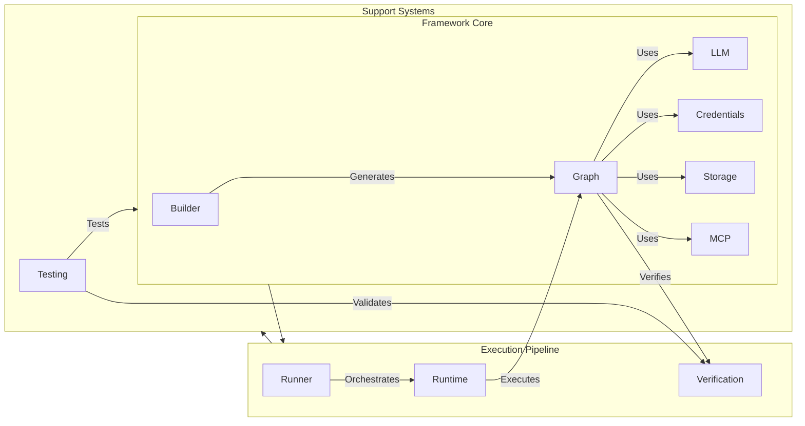
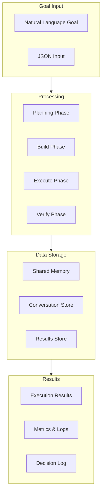
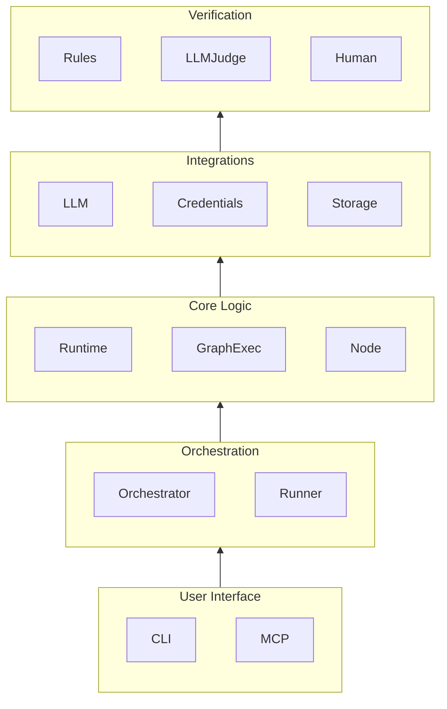
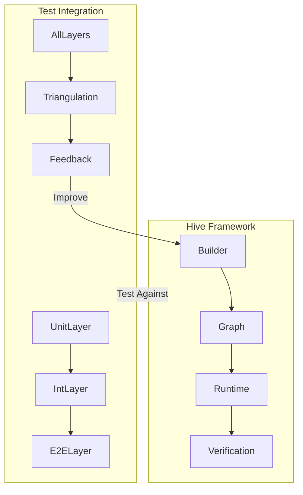
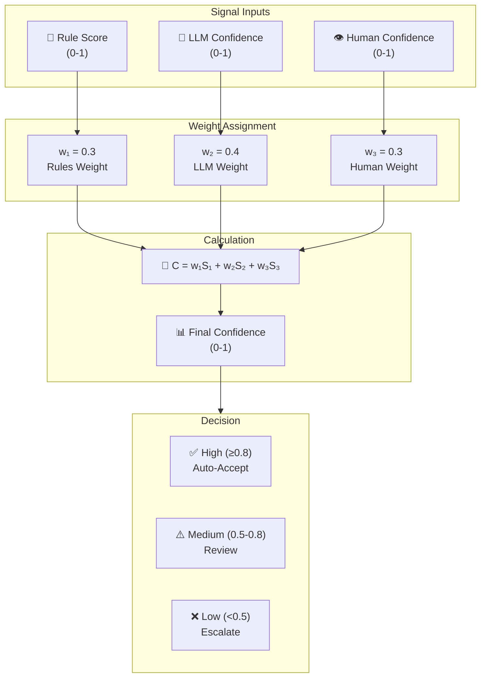

# Hive Agent Framework - Architecture Diagram

## High-Level System Architecture

```mermaid
flowchart TB
    subgraph User["User Layer"]
        Goal["Natural Language Goal"]
        HITL["Human-in-the-Loop"]
    end

    subgraph Builder["Builder Layer"]
        Plan["Plan Generator"]
        Builder["Agent Builder"]
        Query["Query Builder"]
    end

    subgraph Core["Core Framework"]
        subgraph Runtime["Runtime Layer"]
            AgentRuntime["Agent Runtime"]
            ExecutionStream["Execution Stream"]
            EventBus["Event Bus"]
            OutcomeAgg["Outcome Aggregator"]
        end

        subgraph Graph["Graph Execution Layer"]
            GraphExec["Graph Executor"]
            Node["Node Base Class"]
            WorkerNode["Worker Node"]
            FlexExec["Flexible Executor"]
        end

        subgraph LLM["LLM Integration Layer"]
            Anthropic["Anthropic Provider"]
            LiteLLM["LiteLLM Provider"]
            Mock["Mock Provider"]
        end

        subgraph Credentials["Credentials Layer"]
            Store["Credential Store"]
            Vault["Vault Integration"]
            OAuth2["OAuth2 Provider"]
            ADen["ADen Sync"]
        end

        subgraph MCP["MCP Layer"]
            AgentBuilderServer["Agent Builder MCP Server"]
        end

        subgraph Storage["Storage Layer"]
            Backend["Storage Backend"]
            Conversation["Conversation Store"]
            Concurrent["Concurrent Storage"]
        end

        subgraph Runner["Runner Layer"]
            Orchestrator["Orchestrator"]
            MCPRunner["MCP Runner"]
            CLI["CLI Runner"]
        end
    end

    subgraph Verification["Triangulated Verification"]
        Rules["Deterministic Rules"]
        LLMJudge["LLM Judge"]
        Human["Human Judgment"]
    end

    subgraph Testing["Testing Framework"]
        TestCase["Test Cases"]
        LLMJudgeTest["LLM Judge Testing"]
        Debug["Debug Tools"]
    end

    %% Connections
    Goal --> Builder
    Builder --> Core
    Core --> Verification
    Verification -->|Low Confidence| HITL
    Core --> Testing

    Builder --> Plan
    Builder --> Query

    Runtime --> Graph
    Graph --> LLM
    Graph --> Credentials
    Graph --> MCP
    Graph --> Storage

    Runner --> Runtime
```

## Component Interconnection Details



## Data Flow Architecture



## Layer Dependencies



## Test Architecture Diagram

```mermaid
flowchart TB
    subgraph TestInput["Test Input Layer"]
        TestGoal["🎯 Test Goal Definition"]
        TestCase["📝 Test Case"]
        TestScenario["🔧 Test Scenario"]
    end

    subgraph UnitTest["Unit Testing Layer"]
        subgraph UnitFixtures["Test Fixtures"]
            MockAgent["🤖 MockAgent"]
            StubEnv["🏠 StubEnvironment"]
            MockLLM["🦊 MockLLM Provider"]
            MockCred["🔐 MockCredentials"]
        end

        subgraph UnitComponents["Component Tests"]
            NodeTest["📦 Node Tests"]
            GraphTest["🔄 Graph Tests"]
            SchemaTest["📋 Schema Tests"]
            StorageTest["💾 Storage Tests"]
        end

        subgraph UnitVerify["Verification Methods"]
            UnitAssert["✅ Assertion-Based"]
            UnitCompare["🔍 Comparison-Based"]
        end
    end

    subgraph IntegrationTest["Integration Testing Layer"]
        subgraph IntFixtures["Integration Fixtures"]
            RealLLM["🦊 Real LLM Provider"]
            RealEnv["🌐 Real Environment"]
            TestDB["🗄️ Test Database"]
        end

        subgraph IntComponents["Integration Tests"]
            AgentEnv["👤 Agent-Environment Tests"]
            LLMInt["🧠 LLM Integration Tests"]
            CredInt["🔐 Credential Integration Tests"]
            MCPInt["🛠️ MCP Integration Tests"]
        end

        subgraph IntVerify["Verification Methods"]
            ExecAssert["⚡ Execution-Based"]
            OutputMatch["📊 Output Matching"]
        end
    end

    subgraph E2ETest["End-to-End Testing Layer"]
        subgraph E2EComponents["E2E Tests"]
            FullGoal["🎯 Full Goal Execution"]
            MultiAgent["👥 Multi-Agent Workflows"]
            LongRun["⏱️ Long-Running Tests"]
            HITLTest["👤 HITL Scenarios"]
        end

        subgraph E2EVerify["Verification Methods"]
            GoalAchievement["🏆 Goal Achievement"]
            BehaviorTrace["📜 Behavior Tracing"]
            MetricValidation["📈 Metric Validation"]
        end
    end

    subgraph TriangulatedVerify["Triangulated Verification Layer"]
        subgraph VerifyMethods["Verification Methods"]
            V1["📏 Signal 1: Deterministic Rules"]
            V2["🧠 Signal 2: LLM Evaluation"]
            V3["👁️ Signal 3: Human Judgment"]
        end

        subgraph Arbitration["Test Oracle Arbitration"]
            ConflictDetect["⚠️ Conflict Detection"]
            ConfidenceScore["📊 Confidence Scoring"]
            ArbitrationLogic["⚖️ Arbitration Logic"]
            Resolution["🎯 Resolution Decision"]
        end
    end

    subgraph TestFeedback["Feedback & Improvement Layer"]
        subgraph Regression["Regression Detection"]
            RegressionTrack["📈 Regression Tracking"]
            BaselineCompare["📉 Baseline Comparison"]
            TrendAnalysis["📊 Trend Analysis"]
        end

        subgraph PromptImprove["Prompt Improvement"]
            FeedbackLoop["🔄 Feedback to Builder"]
            PromptRefine["✏️ Prompt Refinement"]
            HintGen["💡 Hint Generation"]
        end

        subgraph Confidence["Confidence Mechanisms"]
            ScoreAgg["📊 Score Aggregation"]
            ThresholdCheck["🚦 Threshold Checking"]
            UncertaintyFlag["⚠️ Uncertainty Flagging"]
        end
    end

    subgraph TestOutput["Test Output Layer"]
        TestReport["📋 Test Report"]
        MetricsDashboard["📊 Metrics Dashboard"]
        RegressionReport["📉 Regression Report"]
        ConfidenceMap["🗺️ Confidence Map"]
    end

    %% Data Flow Connections
    TestInput --> UnitTest
    UnitTest -->|Pass| IntegrationTest
    IntegrationTest -->|Pass| E2ETest
    E2ETest --> TriangulatedVerify

    UnitFixtures --> UnitComponents
    UnitComponents --> UnitVerify

    IntFixtures --> IntComponents
    IntComponents --> IntVerify

    E2EComponents --> E2EVerify

    V1 --> Arbitration
    V2 --> Arbitration
    V3 --> Arbitration

    Arbitration --> TestFeedback
    TestFeedback --> TestOutput

    Arbitration -->|Feedback| PromptImprove
    PromptImprove -->|Improved Prompt| Builder

    ConfidenceScore --> ScoreAgg
    ThresholdCheck --> ScoreAgg
    UncertaintyFlag --> ScoreAgg

    RegressionTrack --> RegressionReport
    BaselineCompare --> RegressionReport
    TrendAnalysis --> RegressionReport

    %% Styling
    style TestInput fill:#e3f2fd,stroke:#1976d2
    style UnitTest fill:#fff3e0,stroke:#f57c00
    style IntegrationTest fill:#e8f5e9,stroke:#388e3c
    style E2ETest fill:#fce4ec,stroke:#c2185b
    style TriangulatedVerify fill:#f3e5f5,stroke:#7b1fa2
    style TestFeedback fill:#e0f7fa,stroke:#0097a7
    style TestOutput fill:#fff8e1,stroke:#ffa000
```



## Test Data Flow Through Triangulated Verification

```mermaid
flowchart LR
    subgraph TestCase["Test Case Entry"]
        TC["📝 Test Case\nGoal + Expected Outcome"]
    end

    subgraph Execution["Test Execution"]
        Execute["⚡ Execute\nAgent/Node/Graph"]
        Result["📊 Raw Result"]
    end

    subgraph Triangulation["Triangulated Verification"]
        subgraph Signals["Verification Signals"]
            Signal1["📏 Signal 1\nDeterministic Rules"]
            Signal2["🧠 Signal 2\nLLM Evaluation"]
            Signal3["👁️ Signal 3\nHuman Judgment"]
        end

        subgraph Confidence["Confidence Calculation"]
            Agg["📊 Aggregate\nSignals"]
            Score["📈 Confidence\nScore"]
        end

        subgraph Decision["Final Decision"]
            Judge["⚖️ Arbitration"]
            Decision["🎯 PASS | FAIL | UNCERTAIN"]
        end
    end

    subgraph Feedback["Feedback Loop"]
        Improvement["🔄 Prompt/Graph\nImprovement"]
        Regression["📉 Regression\nDetection"]
        Tracking["📈 Trend\nTracking"]
    end

    TC --> Execute
    Execute --> Result
    Result --> Signal1
    Result --> Signal2
    Result --> Signal3

    Signal1 --> Agg
    Signal2 --> Agg
    Signal3 --> Agg

    Agg --> Score
    Score --> Judge
    Judge --> Decision

    Decision -->|FAIL/UNCERTAIN| Feedback
    Feedback --> Improvement
    Decision --> Regression
    Regression --> Tracking

    %% Styling
    style TestCase fill:#e3f2fd,stroke:#1976d2
    style Execution fill:#fff3e0,stroke:#f57c00
    style TriangulatedVerify fill:#f3e5f5,stroke:#7b1fa2
    style Feedback fill:#e8f5e9,stroke:#388e3c
```

## Test Oracle Arbitration Logic

```mermaid
flowchart TB
    subgraph Input["Arbitration Input"]
        R1["📏 Rule Result\n(PASS | FAIL)"]
        R2["🧠 LLM Result\n(PASS | FAIL | CONFIDENCE)"]
        R3["👁️ Human Result\n(PASS | FAIL | ESCALATE)"]
    end

    subgraph Conflict["Conflict Detection"]
        Match["✅ All Match\nConsensus"]
        Conflict["⚠️ Conflict\nDetected"]
        Partial["⚡ Partial\nAgreement"]
    end

    subgraph Scoring["Confidence Scoring"]
        WeightedScore["⚖️ Weighted\nScoring"]
        Uncertainty["🎯 Uncertainty\nQuantification"]
        Threshold["🚦 Threshold\nCheck"]
    end

    subgraph Resolution["Resolution Logic"]
        Consensus["🎯 Return Consensus"]
        LowConfidence["⚠️ Escalate to Human"]
        ReExecute["🔄 Re-execute Test"]
        Record["📝 Record for Analysis"]
    end

    Input --> Conflict
    Conflict -->|Consensus| Scoring
    Conflict -->|Conflict| Scoring
    Conflict -->|Partial| Scoring

    Scoring --> Threshold

    Threshold -->|High Confidence| Resolution
    Threshold -->|Low Confidence| Resolution
    Threshold -->|Below Threshold| Resolution

    Resolution -->|PASS/FAIL| Consensus
    Resolution -->|Uncertain| LowConfidence
    Resolution -->|Execution Issue| ReExecute
    Resolution -->|Conflict Pattern| Record
```

## File Structure with Component Mapping

```
hive/
├── core/framework/
│   ├── builder/          → Agent Builder
│   ├── credentials/      → Credential Management
│   ├── graph/           → Graph Execution
│   ├── llm/             → LLM Providers
│   ├── mcp/             → MCP Integration
│   ├── runner/          → Runner & Orchestrator
│   ├── runtime/         → Agent Runtime
│   ├── schemas/         → Data Schemas
│   ├── storage/         → Storage Backend
│   └── testing/         → Testing Framework
│       ├── test_case.py
│       ├── test_result.py
│       ├── llm_judge.py
│       └── debug_tool.py
├── docs/               → Documentation
└── tests/             → Integration Tests
```

## Key Connections Summary

| From Component | To Component | Purpose |
|---------------|--------------|---------|
| Builder | Graph | Generates agent graph from goals |
| Graph | LLM | Executes nodes using LLMs |
| Graph | Credentials | Access to secure credentials |
| Graph | Storage | Persist state and conversations |
| Graph | MCP | Use MCP tools |
| Runtime | Graph | Execute graph nodes |
| Runner | Runtime | Orchestrate execution |
| Verification | Graph | Validate node outputs |
| Testing | All | Validate components |

## Test Layer Integration



## Confidence Scoring System


hive/
├── core/framework/
│   ├── builder/          → Agent Builder
│   ├── credentials/      → Credential Management
│   ├── graph/           → Graph Execution
│   ├── llm/             → LLM Providers
│   ├── mcp/             → MCP Integration
│   ├── runner/          → Runner & Orchestrator
│   ├── runtime/         → Agent Runtime
│   ├── schemas/         → Data Schemas
│   ├── storage/         → Storage Backend
│   └── testing/         → Testing Framework
│       ├── test_case.py
│       ├── test_result.py
│       ├── llm_judge.py
│       └── debug_tool.py
├── docs/               → Documentation
└── tests/             → Integration Tests
The Hive Agent Framework is organized into layered architecture:

User Layer: CLI, MCP Protocol, REST API
Builder Layer: Plan Generator, Agent Builder, Query Builder
Core Framework: Runtime, Graph Execution, LLM, Credentials, Storage, MCP
Verification: Triangulated Verification (Rules, LLM Judge, Human)
Testing: Unit, Integration, and E2E Testing with feedback loops
The framework uses MCP protocol to communicate with tools, enabling flexible tool ecosystems and production-ready agent development.
From Component	To Component	Purpose
Builder	Graph	Generates agent graph from goals
Graph	LLM	Executes nodes using LLMs
Graph	Credentials	Access to secure credentials
Graph	Storage	Persist state and conversations
Graph	MCP	Use MCP tools
Runtime	Graph	Execute graph nodes
Runner	Runtime	Orchestrate execution
Verification	Graph	Validate node outputs
Testing	All	Validate component 
